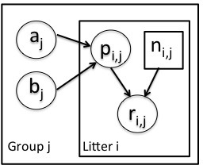

# Using and customizing MCMC in NIMBLE

1.) The file `litters.R` provides BUGS code and data/constants/initial values for a hierarchical model for survival data for rat pups in a simple experiment with a treatment and a control. 

There are ```G=2``` groups of rat litters, with ```N=16```  litters (i.e., mothers) in each group, and a variable number of pups in each litter. Survival of the pups in a litter is governed by a survival probability for each litter, ```p[i,j]```, but the probabilities for the litters within a group are considered to come from a common distribution, ```p[i,j] ~ dbeta(a[i], b[i])```, thereby borrowing strength across the litters in a group.

<center></center>

  - Examine the BUGS code and assess whether you understand the model structure (and ask me if you don't).
  - Run an MCMC for this model. 
  - Assess how it performs. If it doesn't perform well, what aspects of the model structure might be causing problems.  
  - Try to customize the MCMC (feel free to ask me for hints).

2.) Alternatively, experiment more with the MCMC for the state space model. You might try slice samplers for the variance parameters. 

3.) (Advanced) Can you figure out how to reparameterize the state space model so that one doesn't have parameters such as `r[t]` that have many dependent nodes?

# Operating a model

4.) Experiment with different values for the top-level (hyperparameter) nodes in the model, simulating values for the true and observed population sizes over time given hyperparameter values that you choose. Plot these sizes to get a better understanding of how the hyperparameters determine population growth. 

Note that to simulate into data nodes, you'll need to call `model$resetData()` so that NIMBLE allows you to override the values of the data nodes. 
